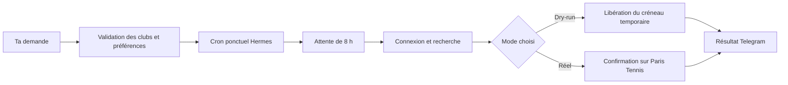

<div align="center">


# Paris Tennis · Tenibotty

**Ton prochain échange commence par un message.**

Trouve le bon court sur Paris Tennis, prépare ta tentative à l’ouverture
et gère ta réservation depuis un terminal ou ton bot Telegram avec Hermes.

**Gratuité compatible · Clubs par arrondissement · Tentatives à 8 h · Calendrier ICS · Open source**

[Démarrer](#demarrer) · [Voir les exemples Telegram](#telegram) · [Guide complet](docs/guide.md) · [Signaler un problème](https://github.com/RolandVrignon/paris-tennis-tenibotty/issues)

</div>

---

## Le plus dur devrait être ton revers

Trouver le nom exact du centre. Vérifier les courts couverts. Se rappeler l’ouverture. Refaire la recherche quand ton premier choix est complet.

**Tenibotty prend en charge cette préparation.** Tu choisis les clubs, les horaires et les partenaires ; le script cherche dans ton ordre de préférence, ajoute les joueurs et suit le parcours de réservation de ton compte.

> « Je veux jouer lundi prochain à 18 h, sinon 19 h. Max Rousié d’abord, Jesse Owens ensuite, en couvert, avec Paul Dupont. Programme la tentative à l’ouverture. »

Avec Hermes, la demande devient une tentative ponctuelle sur ton VPS. Tu peux ensuite consulter la réservation, gérer la demande programmée ou demander une annulation depuis la même conversation.

**Une tentative programmée ne garantit pas un terrain.** La disponibilité, la connexion et un éventuel CAPTCHA restent déterminants.

## Le tour du court

- [Ce que le bot fait pour toi](#fonctionnalites)
- [Parle tennis, pas commandes](#telegram)
- [Le rendez-vous de 8 h](#programmation)
- [Tes clubs, tes heures, tes partenaires](#preferences)
- [Gratuité, tarif réduit ou tarif plein](#tarifs)
- [Ton premier essai](#demarrer)
- [Hermes et Telegram sur VPS](#hermes)
- [Les commandes essentielles](#commandes)
- [Calendrier et notifications](#notifications)
- [Ce qu’il faut savoir](#fiabilite)
- [Documentation et contribution](#documentation)

<a id="fonctionnalites"></a>
## Un partenaire pour la réservation

| Tu veux… | Tenibotty s’en charge |
| --- | --- |
| **Trouver un centre près de chez toi** | Consulte le catalogue officiel et filtre les clubs par arrondissement. |
| **Utiliser le bon nom** | Résout les accents et la casse, propose les correspondances et signale les ambiguïtés. |
| **Garder un plan B** | Essaie les clubs dans l’ordre, puis tes heures préférées dans chaque club. |
| **Choisir ton court** | Filtre les courts couverts ou découverts ; permet de limiter les numéros de courts par centre. |
| **Profiter de ton tarif** | Gère `Gratuité`, `Tarif réduit` et `Tarif plein` selon les droits déjà actifs sur ton compte. |
| **Tenter à l’ouverture** | Prépare une demande ponctuelle avec Hermes et lance le navigateur à 8 h, six jours avant le match. |
| **Tester avant de réserver** | Propose un dry-run visible qui va jusqu’au paiement puis libère la réservation temporaire. |
| **Gérer la suite** | Consulte la réservation courante, l’annule sur demande et génère un événement ICS après confirmation. |

<a id="telegram"></a>
## Parle tennis, pas commandes

Ces exemples sont des **demandes à envoyer à Hermes**, une fois le projet installé et Telegram connecté.

### 📍 Trouver le bon club

> Quels centres de tennis connais-tu dans le 18e ?

> Vérifie que Max Rousié existe et donne-moi son libellé exact et son adresse.

### 🎾 Préparer le prochain match

> Programme une réservation pour lundi prochain : Max Rousié puis Jesse Owens, 18 h puis 19 h, en couvert, avec Paul Dupont.

> Prépare la même demande en dry-run : je veux tester sans confirmer de réservation.

### 🗓️ Changer le programme

> Quelles demandes de réservation sont programmées ?

> Pour la demande de lundi, mets 19 h en premier choix et 18 h en second.

> Annule ma demande programmée pour lundi.

### ✅ Gérer la réservation du compte

> Affiche ma réservation actuelle sur Paris Tennis.

> Annule ma réservation de mardi à 18 h.

Hermes vérifie les clubs, conserve le contexte et demande seulement les informations manquantes avant d’agir. Si la date manque, le skill propose une date à partir de J+7 pour préparer une future tentative ; cette indication est recalculée en heure de Paris à chaque conversation. Une **demande programmée** est une tentative future ; une **réservation du compte** existe déjà sur Paris Tennis. Annuler l’une n’annule pas l’autre.

[Le fonctionnement Hermes en détail →](docs/guide.md#utiliser-hermes-et-telegram)

<a id="programmation"></a>
## Un message aujourd’hui. Une tentative à 8 h.

Le gestionnaire calcule son lancement **six jours calendaires avant la date du terrain**, dans le fuseau Europe/Paris, en tenant compte des changements d’heure.

| Moment | Ce qui se passe |
| --- | --- |
| **Tu prépares la demande** | Les clubs, horaires, types de courts et partenaires sont validés. |
| **Hermes programme** | Il crée un cron ponctuel, attache son identifiant à la demande et vérifie la tâche. |
| **07 h 55, à J−6 du match** | Le lanceur démarre sur le VPS et attend l’heure prévue. |
| **08 h 00** | Chromium démarre, puis le script se connecte et cherche selon tes préférences. |
| **Après la tentative** | Le résultat revient au chat ou topic Telegram d’origine via Hermes. |

Par exemple, un match le **21 septembre** correspond à un lancement le **15 septembre à 8 h** selon cette règle. Le bot ne démarre pas le navigateur avant 8 h et ne garantit pas une réservation à la seconde.



La demande est figée dans un fichier privé. Au lancement, le script s’exécute sans appel à un modèle pour décider quoi réserver. Une demande terminée ou annulée ne peut pas être rejouée automatiquement.

**Préparer un fichier ne crée pas un cron.** C’est Hermes qui enregistre la tâche. Le lancement direct avec `npm start`, lui, réserve immédiatement.

[Gérer, modifier et annuler une demande programmée →](docs/guide.md#gérer-les-demandes-programmées)

<a id="preferences"></a>
## Tes clubs. Tes heures. Tes partenaires.

Deux fichiers séparent ce qui reste stable de ce qui change à chaque match :

| Fichier privé | Contenu |
| --- | --- |
| `config.fixed.json` | Compte Paris Tennis, tarifs acceptés, reconnaissance CAPTCHA et notifications. |
| `config.request.json` | Date, clubs, horaires, types de courts et partenaires. |

Exemple de demande — **remplace la date et le partenaire avant de lancer** :

```json
{
  "date": "21/09/2026",
  "locations": ["Max Rousié", "Jesse Owens"],
  "hours": ["18", "19"],
  "courtType": ["Couvert"],
  "players": [
    { "firstName": "PRENOM_PARTENAIRE", "lastName": "NOM_PARTENAIRE" }
  ]
}
```

Ce choix signifie : **Max Rousié à 18 h, puis à 19 h ; ensuite Jesse Owens à 18 h, puis à 19 h**. `courtType` filtre les types autorisés ; leur ordre ne définit pas une préférence.

Tu peux autoriser `Couvert`, `Découvert` ou les deux, et renseigner un à trois partenaires sans inclure le titulaire du compte. Pour cibler certains courts, `locations` peut aussi prendre cette forme :

```json
{
  "locations": {
    "Max Rousié": [1, 2],
    "Suzanne Lenglen": []
  }
}
```

Ici, seuls les courts 1 et 2 de Max Rousié sont acceptés ; tous les courts de Suzanne Lenglen restent possibles, sous réserve des autres filtres.

Les dates utilisent `D/M/YYYY` ou `DD/MM/YYYY`. Sans date en lancement direct, le script cherche à J+6. Une demande Hermes exige une date explicite.

[Tous les champs et la migration de l’ancien `config.json` →](docs/guide.md#configuration)

<a id="padel"></a>
## Padel Jules Ladoumègue

Le padel municipal de [Jules Ladoumègue](https://tennis.paris.fr/tennis/#PadelJulesLadoum%C3%A8gue) est pris en charge dans ce même parcours Paris Tennis. Choisir **`"sport": "padel"`** et le libellé exact **`Padel Jules Ladoumègue`** (19e). Sans `sport`, le script conserve le mode `tennis`.

Le mode padel sélectionne uniquement les pistes identifiées comme padel dans le catalogue officiel. Les anciens courts de tennis encore présents sur la fiche sont exclus, même si leurs numéros se recoupent. Le site exige **trois partenaires, en plus du titulaire du compte** ; une demande incomplète est refusée avant connexion.

```sh
cp -n config.padel.json.sample config.padel.json
chmod 600 config.padel.json
# Compléter les trois partenaires, les heures et éventuellement la date.
TENNIS_REQUEST_CONFIG_PATH=./config.padel.json npm run start-dry-headed
```

Les paramètres fixes du compte et le tarif restent dans `config.fixed.json`. Le fichier d’exemple utilise `Couvert`, libellé actuellement affiché sur les créneaux padel du site. Pour le lancement direct, l’absence de date signifie J+6. Pour Hermes, fournir une date explicite et demander par exemple « Programme une réservation de padel à Jules Ladoumègue avec mes trois partenaires ».

Le compte gratuit conserve `"priceType": ["Gratuité"]`. Pour un tarif payant, conserver le tarif autorisé et un carnet compatible ; aucun achat automatique de carnet n’est ajouté. Les confirmations, annulations, notifications et fichiers ICS utilisent le même moteur.

Le dry-run complet nécessite trois partenaires renseignés : la seule détection de pistes disponibles ne prouve pas la réussite d’une réservation.

<a id="tarifs"></a>
## Gratuité comprise

Le parcours gratuit est intégré au même moteur de réservation que les tarifs payants.

| Ton tarif | Valeur exacte dans `priceType` | Ce qu’il faut prévoir |
| --- | --- | --- |
| **Gratuité** | `["Gratuité"]` | Gratuité déjà activée sur ton compte. **Aucun carnet nécessaire.** |
| **Tarif réduit** | `["Tarif réduit"]` | Un carnet existant adapté au tarif et au type de court. |
| **Tarif plein** | `["Tarif plein"]` | Un carnet existant adapté au tarif et au type de court. |

Ce paramètre ne change pas tes droits sur Paris Tennis. Le libellé est exact : `Gratuité`, avec son accent, et non `gratuit` ou `free`. Plusieurs tarifs peuvent être acceptés ; leur ordre n’établit pas de priorité.

**Le parcours payant utilise tes carnets : le script ne réalise pas un achat de carnet par carte bancaire.**

<a id="demarrer"></a>
## Ton premier essai

**Prérequis : Node.js 22.22.2 ou 24, npm et un compte Paris Tennis.** Le catalogue des clubs peut être consulté sans compte. Un navigateur visible nécessite une session graphique.

```sh
git clone https://github.com/RolandVrignon/paris-tennis-tenibotty.git
cd paris-tennis-tenibotty
npm ci
```

Chromium est téléchargé à l’installation. Pour une nouvelle configuration :

```sh
cp -n config.fixed.json.sample config.fixed.json
cp -n config.request.json.sample config.request.json
chmod 600 config.fixed.json config.request.json
```

Complète ton compte, ton tarif et tes préférences dans ces fichiers. Si tu possèdes déjà un `config.json`, suis d’abord la [migration](docs/guide.md#migrer-une-ancienne-configuration).

Puis teste le parcours avec le navigateur visible :

```sh
npm run start-dry-headed
npm run reservations:list
```

Le dry-run se connecte, cherche un créneau, ajoute les partenaires et atteint l’étape de paiement. Il annule ensuite la réservation temporaire **avant confirmation**, quel que soit le tarif. Vérifie le compte après le test : le message « Fausse réservation faite » s’affiche avant l’annulation et ne suffit pas à prouver sa réussite.

Une fois ce parcours validé, cette commande effectue une **réservation réelle immédiate** :

```sh
npm start
```

Sous Linux, les dépendances système de Chromium peuvent nécessiter `npx playwright install --with-deps chromium`. Pour commencer par une simple recherche de club :

```sh
npm run clubs:list -- --arrondissement 18
npm run clubs:find -- --query "max rousie"
```

<a id="hermes"></a>
## Ton VPS prend le relais

Hermes et sa connexion Telegram doivent être configurés au préalable. L’installateur adapte automatiquement le skill au chemin absolu de ton clone ; `HERMES_HOME` permet de choisir un autre dossier Hermes.

Depuis le dépôt sur le VPS, après installation des dépendances et configuration des fichiers privés :

```sh
npm run hermes:install
hermes skills list
```

Le skill [tennis-booking](skills/tennis-booking/SKILL.md) regroupe la recherche de clubs, la gestion de la réservation du compte et la préparation des demandes programmées. L’installateur sauvegarde la version précédente ; il ne crée aucune tâche et n’envoie aucun message.

Le lanceur utilise `flock` sous Linux pour sérialiser les opérations. Les identifiants restent dans la configuration privée du VPS ; ils ne doivent pas figurer dans les prompts, les noms de crons ou les messages Telegram.

[Installation VPS et configuration Hermes →](docs/guide.md#installer-le-skill-sur-le-vps)

<a id="commandes"></a>
## Les commandes à garder sous la main

| Action | Commande | Effet |
| --- | --- | --- |
| Consulter les clubs | `npm run clubs:list` | Lit le catalogue officiel. |
| Résoudre un nom | `npm run clubs:find -- --query "max rousie"` | Recherche le libellé exact. |
| Tester en visible | `npm run start-dry-headed` | Parcours de réservation temporaire, puis annulation. |
| Tester sans fenêtre | `npm run start-dry` | Même test en headless. |
| **Réserver maintenant** | `npm start` | **Confirme une réservation réelle** si un créneau compatible est trouvé. |
| Consulter le compte | `npm run reservations:list` | Lit la réservation courante sur Paris Tennis. |
| Prévisualiser une annulation | `npm run reservations:cancel -- --id 'ID'` | Vérifie la réservation sans soumettre l’annulation. |
| **Annuler réellement** | `npm run reservations:cancel -- --id 'ID' --confirm` | **Soumet l’annulation** de la réservation identifiée et vérifie le résultat. |
| Voir les demandes futures | `npm run booking:list` | Affiche les demandes gérées par le helper Hermes. |

Pour annuler, utilise l’ID renvoyé par `reservations:list`. C’est une référence locale des détails affichés, pas un numéro de confirmation Paris Tennis. La consultation actuelle ne constitue pas un historique complet du compte.

[Gestion des réservations](docs/guide.md#consulter-et-annuler-une-réservation) · [Statuts et demandes futures](docs/guide.md#comprendre-les-statuts)

<a id="notifications"></a>
## Du créneau au calendrier

Après confirmation, le lancement local génère **`event.ics`**, prêt à importer dans ton calendrier. Les notifications **ntfy** peuvent transmettre cet événement ; les jobs **Hermes** livrent séparément leur résumé dans le chat Telegram d’origine.

Les notifications sont configurables dans `config.fixed.json`. Une erreur de notification ou d’écriture du calendrier après confirmation ne doit pas déclencher une nouvelle réservation.

[Activer ntfy et comprendre la génération ICS →](docs/guide.md#calendrier-et-notifications)

<a id="fiabilite"></a>
## Ce qu’il faut savoir avant le premier service

### CAPTCHA : automatique quand possible, manuel en secours

L’intégration tente de reconnaître les CAPTCHAs textuels lorsqu’ils apparaissent via un Space Hugging Face configuré. Le code utilise son accès public **sans clé API** et transmet seulement l’image du CAPTCHA. La disponibilité du fournisseur et la reconnaissance ne sont pas garanties.

En cas d’échec, le mode visible permet une saisie manuelle dans le délai de l’étape. En headless, l’exécution s’arrête. Les puzzles de sélection d’images ne sont pas pris en charge. Un lancement pendant ton sommeil peut donc échouer sans intervention.

[Paramètres, fournisseur et diagnostic CAPTCHA →](docs/guide.md#captcha-et-hugging-face)

### Des résultats lisibles

Le gestionnaire distingue une réservation confirmée, un dry-run terminé avec annulation vérifiée, un créneau indisponible et un résultat incertain. Il conserve les traces nécessaires à la vérification et empêche de rejouer automatiquement une demande terminée.

L’annulation d’une réservation confirmée dispose de tests sur formulaire simulé. Ils ne garantissent pas tous les parcours du site réel. Le dry-run vérifie la libération de sa réservation temporaire ; ce sont deux opérations différentes.

Les configurations, partenaires, journaux et captures restent privés et ignorés par Git. Un changement d’interface, une session ou un CAPTCHA peuvent nécessiter une intervention. Les protections locales supposent un dossier d’état partagé par compte ; elles ne coordonnent pas plusieurs machines indépendantes.

<a id="documentation"></a>
## Sous le capot, tout reste accessible

**Node.js · Playwright · Chromium · Hermes · Telegram · ntfy · ICS**

| Pour aller plus loin | Ressource |
| --- | --- |
| Installer, configurer, migrer et dépanner | [Guide complet](docs/guide.md) |
| Comprendre les actions du bot Telegram | [Skill tennis-booking](skills/tennis-booking/SKILL.md) |
| Programmer et gérer une demande future | [Gestionnaire Hermes](docs/guide.md#gérer-les-demandes-programmées) |
| Exécuter depuis GitHub Actions | [Workflows et secrets](docs/guide.md#github-actions) |
| Diagnostiquer un échec | [Diagnostic et validation](docs/guide.md#diagnostic-et-validation) |

Une idée, un parcours qui change ou un problème reproductible ? Ouvre une [issue](https://github.com/RolandVrignon/paris-tennis-tenibotty/issues) ou une [pull request](https://github.com/RolandVrignon/paris-tennis-tenibotty/pulls), avec les étapes utiles et sans données privées.

```sh
npm run eslint
npm test
```

Ce fork prolonge le travail de [Bertrand d’Aure](https://github.com/bertrandda/par-ici-tennis). Projet indépendant, non affilié à la Ville de Paris. Distribué sous [licence MIT](LICENSE).

---

<div align="center">

**Tu joues aussi au padel ?** Retrouve la même approche avec [Paris Padel · Anybotty](https://github.com/RolandVrignon/paris-padel-anybotty).

**La réservation se prépare ici. Le match se joue sur le court.**

[Démarrer](#demarrer) · [Ouvrir le guide](docs/guide.md) · [Voir le code](https://github.com/RolandVrignon/paris-tennis-tenibotty)

</div>
