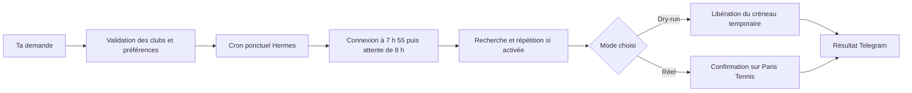

<div align="center">


# Paris Tennis · Tenibotty

**Ton prochain échange commence par un message.**

Trouve le bon court sur Paris Tennis, prépare ta tentative à l’ouverture
et gère ta réservation depuis un terminal ou ton bot Telegram avec Hermes.

**Gratuité compatible · Clubs par arrondissement · Tentatives à 8 h · Calendrier ICS · Open source**

[Démarrer](#demarrer) · [Voir les exemples Telegram](#telegram) · [Guide complet](docs/guide.md) · [Signaler un problème](https://github.com/RolandVrignon/paris-tennis-tenibotty/issues)

</div>

---

## Le plus dur devrait être ton revers

Trouver le nom exact du centre. Vérifier les courts couverts. Se rappeler l’ouverture. Refaire la recherche quand ton premier choix est complet.

**Tenibotty prend en charge cette préparation.** Tu choisis les clubs, les horaires et les partenaires ; le script cherche dans ton ordre de préférence, ajoute les joueurs et suit le parcours de réservation de ton compte.

> « Je veux jouer lundi prochain à 18 h, sinon 19 h. Max Rousié d’abord, Jesse Owens ensuite, en couvert, avec Rafael Nadal. Programme la tentative à l’ouverture. »

Avec Hermes, la demande devient une tentative ponctuelle sur ton VPS. Tu peux ensuite consulter la réservation, gérer la demande programmée ou demander une annulation depuis la même conversation.

**Une tentative programmée ne garantit pas un terrain.** La disponibilité, la connexion et un éventuel CAPTCHA restent déterminants.

## Le tour du court

- [Ce que le bot fait pour toi](#fonctionnalites)
- [Parle tennis, pas commandes](#telegram)
- [Le rendez-vous de 8 h](#programmation)
- [Tes clubs, tes heures, tes partenaires](#preferences)
- [Gratuité, tarif réduit ou tarif plein](#tarifs)
- [Ton premier essai](#demarrer)
- [Hermes et Telegram sur VPS](#hermes)
- [Les commandes essentielles](#commandes)
- [Calendrier et notifications](#notifications)
- [Ce qu’il faut savoir](#fiabilite)
- [Documentation et contribution](#documentation)

<a id="fonctionnalites"></a>
## Un partenaire pour la réservation

| Tu veux… | Tenibotty s’en charge |
| --- | --- |
| **Trouver un centre près de chez toi** | Consulte le catalogue officiel et filtre les clubs par arrondissement. |
| **Utiliser le bon nom** | Résout les accents et la casse, propose les correspondances et signale les ambiguïtés. |
| **Garder un plan B** | Essaie les clubs dans l’ordre, puis tes heures préférées dans chaque club. |
| **Choisir ton court** | Filtre les courts couverts ou découverts ; permet de limiter les numéros de courts par centre. |
| **Profiter de ton tarif** | Gère `Gratuité`, `Tarif réduit` et `Tarif plein` selon les droits déjà actifs sur ton compte. |
| **Tenter à l’ouverture** | Prépare une demande ponctuelle avec Hermes et prépare le navigateur à 7 h 55 et commence les recherches à 8 h, six jours avant le match. |
| **Tester avant de réserver** | Propose un dry-run visible qui va jusqu’au paiement puis libère la réservation temporaire. |
| **Gérer la suite** | Consulte la réservation courante, l’annule sur demande et génère un événement ICS après confirmation. |

## Comptes nommés et partenaires habituels

Tous les comptes de réservation sont regroupés dans le tableau **`bookingAccounts`**, chacun avec son **nom unique**, ses identifiants, son tarif et ses partenaires par défaut. Il n’y a plus de compte séparé dans `account`, ni de clés `main`, `second` ou `third`. `monitoringAccount` reste un bloc distinct ; ses identifiants peuvent être les mêmes que ceux d’un compte de réservation.

```json
{
  "bookingAccounts": [
    {
      "name": "Roger Federer",
      "email": "COMPTE_ROGER",
      "password": "MOT_DE_PASSE",
      "priceType": ["Gratuité"],
      "defaultPlayers": [{"firstName": "Rafael", "lastName": "Nadal"}]
    },
    {
      "name": "Rafael Nadal",
      "email": "COMPTE_RAFAEL",
      "password": "MOT_DE_PASSE",
      "priceType": ["Tarif plein"],
      "defaultPlayers": [{"firstName": "Roger", "lastName": "Federer"}]
    }
  ],
  "monitoringAccount": {"name": "Monitoring", "email": "", "password": ""}
}
```

Remplace les identités d’exemple par les vrais joueurs. Pour ajouter un troisième ou quatrième compte, ajoute simplement un objet au tableau. Chaque compte possède son propre `priceType`. Un compte payant nécessite toujours un **carnet compatible déjà crédité** : le bot n’achète pas de carnet.

Dans une demande, `bookingAccount` contient le **nom du compte**, par exemple `"Roger Federer"`. Sans ce champ, le premier compte du tableau est choisi ; son nom est enregistré lors de la préparation pour qu’un changement d’ordre du tableau ne change pas le compte d’une demande programmée. Les noms doivent être uniques, sans distinction de casse ou d’espaces autour. Les accents et espaces internes sont acceptés. Si tu renommes un compte, adapte aussi ses demandes en attente ; un nom inconnu provoque une erreur, jamais un remplacement silencieux.

Sans champ `players`, les partenaires du compte sont repris et enregistrés lors de la préparation. Un `players` explicite les remplace pour cette demande seulement. `players: []` est une erreur, pas une demande d’utiliser les valeurs par défaut.

Pour migrer une ancienne configuration et les références de ses demandes en attente :

```sh
node scripts/migrate-booking-accounts.js
node scripts/migrate-booking-accounts.js --apply
```

La première commande vérifie la migration sans écrire. La seconde crée une sauvegarde privée puis convertit `config.fixed.json`, `config.request.json` s’il existe et les demandes préparées ou programmées. Elle conserve leurs horaires, partenaires et choix de créneaux. L’ancien format reste lisible pour les installations non migrées. [Configuration complète d’exemple](config.fixed.json.sample).

### Deux heures consécutives, deux comptes

> Programme deux heures de tennis à Pailleron lundi à 20 h, Roger Federer pour la première heure et Rafael Nadal pour la deuxième, avec leurs partenaires habituels.

```json
{
  "date": "21/09/2026",
  "sport": "tennis",
  "locations": ["Edouard Pailleron"],
  "hours": ["20"],
  "courtType": ["Couvert"],
  "bookingAccount": "Roger Federer",
  "consecutive": {"bookingAccount": "Rafael Nadal"},
  "dryRun": true
}
```

Cette option lance **deux réservations d’une heure en parallèle, dans deux Chromium distincts** : 20–21 h avec le premier compte et 21–22 h avec le second, sur **le même terrain, dans le même centre et pour le même sport**. Une recherche commune, sans pré-réservation, choisit d’abord le terrain et les heures, y compris après un repli padel → tennis. Elle utilise le compte de monitoring s’il est configuré, sinon le compte choisi pour la première heure, et conserve la fenêtre de recherche prévue. Les deux comptes se connectent ensuite séparément, revérifient chacun leur créneau et leur tarif, puis confirment indépendamment. `hours` reste une liste de préférences pour la première heure ; elle ne représente pas une durée. Le départ à 23 h est refusé pour éviter de changer de date.

Les deux réservations ne sont pas atomiques. **Toute heure confirmée est conservée, même si seule la deuxième réussit.** La recherche peut choisir un terrain où seule l’une des deux heures est encore disponible ; à préférence horaire égale, elle privilégie un terrain proposant les deux. Hermes annonce un **succès partiel** et identifie le compte et l’heure obtenue. Aucune annulation automatique d’une réservation confirmée, aucun autre club en remplacement de l’heure manquante et aucune relance de la demande terminée. Une confirmation incertaine demande de vérifier le compte concerné. Les deux comptes de réservation doivent être distincts et correspondre aux joueurs présents ; cette option ne modifie pas les quotas du site. L’application des quotas au padel reste à vérifier auprès du centre.

Le dry-run teste les deux parcours en parallèle et annule chaque pré-réservation avec son propre compte, même si l’autre parcours échoue. Il ne confirme aucun paiement. Deux annulations vérifiées sont nécessaires pour valider le test complet. Deux confirmations réelles produisent `event-1.ics` et `event-2.ics`, ainsi qu’une notification par réservation si ntfy est activé. Sans `consecutive`, le fonctionnement reste celui d’une réservation. Le format JSON reste identique ; aucun champ supplémentaire n’est nécessaire pour le parallélisme.

```sh
node scripts/tennis.js accounts list
node scripts/tennis.js reservations list --account "Rafael Nadal"
node scripts/tennis.js reservations cancel --account "Rafael Nadal" --id <id>
```

`accounts list` expose seulement les noms (également retournés dans `id` pour compatibilité), tarifs, partenaires et l’état de configuration, jamais les identifiants de connexion. Utilise le même `--account` pour la consultation, l’aperçu et la confirmation d’annulation. [Configuration complète d’exemple](config.fixed.json.sample).

<a id="telegram"></a>
## Parle tennis, pas commandes

Ces exemples sont des **demandes à envoyer à Hermes**, une fois le projet installé et Telegram connecté.

### 📍 Trouver le bon club

> Quels centres de tennis connais-tu dans le 18e ?

> Vérifie que Max Rousié existe et donne-moi son libellé exact et son adresse.

### 🎾 Préparer le prochain match

> Programme une réservation pour lundi prochain : Max Rousié puis Jesse Owens, 18 h puis 19 h, en couvert, avec Rafael Nadal.

> Prépare la même demande en dry-run : je veux tester sans confirmer de réservation.

### 🗓️ Changer le programme

> Quelles demandes de réservation sont programmées ?

> Pour la demande de lundi, mets 19 h en premier choix et 18 h en second.

> Annule ma demande programmée pour lundi.

### ✅ Gérer la réservation du compte

> Affiche ma réservation actuelle sur Paris Tennis.

> Annule ma réservation de mardi à 18 h.

Hermes vérifie les clubs, conserve le contexte et demande seulement les informations manquantes avant d’agir. Si la date manque, le skill propose une date à partir de J+7 pour préparer une future tentative ; cette indication est recalculée en heure de Paris à chaque conversation. Une **demande programmée** est une tentative future ; une **réservation du compte** existe déjà sur Paris Tennis. Annuler l’une n’annule pas l’autre.

[Le fonctionnement Hermes en détail →](docs/guide.md#utiliser-hermes-et-telegram)

<a id="programmation"></a>
## Un message aujourd’hui. Une tentative à 8 h.

Le gestionnaire calcule son lancement **six jours calendaires avant la date du terrain**, dans le fuseau Europe/Paris, en tenant compte des changements d’heure.

| Moment | Ce qui se passe |
| --- | --- |
| **Tu prépares la demande** | Les clubs, horaires, types de courts et partenaires sont validés. |
| **Hermes programme** | Il crée un cron ponctuel, attache son identifiant à la demande et vérifie la tâche. |
| **07 h 55, à J−6 du match** | Chromium démarre sur le VPS, se connecte, puis attend l’heure prévue. |
| **08 h 00** | La recherche commence ; avec `polling`, elle se répète dans la fenêtre configurée. |
| **Après la tentative** | Le résultat revient au chat ou topic Telegram d’origine via Hermes. |

Par exemple, un match le **21 septembre** correspond à un lancement le **15 septembre à 8 h** selon cette règle. Le navigateur se connecte avant 8 h ; aucune recherche de créneau ne commence avant l’ouverture prévue. Une confirmation à la seconde n’est pas garantie.



La demande est figée dans un fichier privé. Au lancement, le script s’exécute sans appel à un modèle pour décider quoi réserver. Une demande terminée ou annulée ne peut pas être rejouée automatiquement.

**Préparer un fichier ne crée pas un cron.** C’est Hermes qui enregistre la tâche. Le lancement direct avec `npm start`, lui, réserve immédiatement.

[Gérer, modifier et annuler une demande programmée →](docs/guide.md#gérer-les-demandes-programmées)

<a id="preferences"></a>
## Tes clubs. Tes heures. Tes partenaires.

Deux fichiers séparent ce qui reste stable de ce qui change à chaque match :

| Fichier privé | Contenu |
| --- | --- |
| `config.fixed.json` | Compte Paris Tennis, tarifs acceptés, reconnaissance CAPTCHA et notifications. |
| `config.request.json` | Fichier unique des préférences : sport, date, clubs, horaires, partenaires et replis tennis/padel. |

Exemple de demande — **remplace la date et le partenaire avant de lancer** :

```json
{
  "date": "21/09/2026",
  "locations": ["Max Rousié", "Jesse Owens"],
  "hours": ["18", "19"],
  "courtType": ["Couvert"],
  "players": [
    { "firstName": "PRENOM_PARTENAIRE", "lastName": "NOM_PARTENAIRE" }
  ]
}
```

Ce choix signifie : **Max Rousié à 18 h, puis à 19 h ; ensuite Jesse Owens à 18 h, puis à 19 h**. `courtType` filtre les types autorisés ; leur ordre ne définit pas une préférence.

Tu peux autoriser `Couvert`, `Découvert` ou les deux, et renseigner un à trois partenaires sans inclure le titulaire du compte. Pour cibler certains courts, `locations` peut aussi prendre cette forme :

```json
{
  "locations": {
    "Max Rousié": [1, 2],
    "Suzanne Lenglen": []
  }
}
```

Ici, seuls les courts 1 et 2 de Max Rousié sont acceptés ; tous les courts de Suzanne Lenglen restent possibles, sous réserve des autres filtres.

Les dates utilisent `D/M/YYYY` ou `DD/MM/YYYY`. Sans date en lancement direct, le script cherche à J+6. Une demande Hermes exige une date explicite.

[Tous les champs et la migration de l’ancien `config.json` →](docs/guide.md#configuration)

<a id="padel"></a>
## Padel Jules Ladoumègue

Le padel municipal de [Jules Ladoumègue](https://tennis.paris.fr/tennis/#PadelJulesLadoum%C3%A8gue) est pris en charge dans ce même parcours Paris Tennis. Choisir **`"sport": "padel"`** et le libellé exact **`Padel Jules Ladoumègue`** (19e). Sans `sport`, le script conserve le mode `tennis`.

Le mode padel sélectionne uniquement les pistes identifiées comme padel dans le catalogue officiel. Les anciens courts de tennis encore présents sur la fiche sont exclus, même si leurs numéros se recoupent. Le script accepte **un à trois partenaires, en plus du titulaire du compte**, comme pour le tennis. Il n’impose pas trois partenaires pour accéder au checkout.

Pour le padel, renseigner le même `config.request.json` que pour le tennis :

```json
{
  "sport": "padel",
  "locations": {"Padel Jules Ladoumègue": [1, 2, 3, 4]},
  "hours": ["20"],
  "courtType": ["Couvert"]
}
```

Cet exemple reprend les partenaires par défaut du compte sélectionné. Ajouter `players` pour les remplacer. Pour essayer ensuite le tennis, ajouter `fallbacks` comme dans l’exemple ci-dessous. Le [modèle public](config.request.json.sample) illustre deux heures de tennis à Valeyre, puis Suzanne Lenglen en second choix, avec Roger Federer et Rafael Nadal ; adapter les clubs et les comptes à ses besoins.

```sh
npm run start-dry-headed
```

Aucun fichier de préférences séparé par sport n’est nécessaire. Les paramètres fixes du compte et le tarif restent dans `config.fixed.json`. Le fichier d’exemple utilise `Couvert`, libellé actuellement affiché sur les créneaux padel du site. Pour le lancement direct, l’absence de date signifie J+6. Pour Hermes, fournir une date explicite et demander par exemple « Programme une réservation de padel à Jules Ladoumègue avec mon partenaire ».

Le compte gratuit conserve `"priceType": ["Gratuité"]`. Pour un tarif payant, conserver le tarif autorisé et un carnet compatible ; aucun achat automatique de carnet n’est ajouté. Les confirmations, annulations, notifications et fichiers ICS utilisent le même moteur.

Valider le parcours avec un dry-run : la seule détection de pistes disponibles ou l’accès au checkout ne prouve pas la réussite d’une réservation.

## Repli du padel vers le tennis

Ajouter `fallbacks` aux préférences pour essayer plusieurs sports dans l’ordre. Exemple : padel à Jules Ladoumègue à 20 h, puis tennis à Pailleron à la même heure :

```json
{
  "sport": "padel",
  "locations": ["Padel Jules Ladoumègue"],
  "hours": ["20"],
  "courtType": ["Couvert"],
  "fallbacks": [
    { "sport": "tennis", "locations": ["Edouard Pailleron"] }
  ]
}
```

Cet extrait complète la configuration : conserver `players` et ajouter `date` pour Hermes. Chaque repli exige `sport` et `locations` ; ses `hours` et `courtType` sont facultatifs et reprennent les valeurs principales s’ils sont omis. Le compte, les partenaires, la date et le tarif sont communs.

Sans recherche répétée, le script passe au choix suivant quand aucun créneau ne correspond. Il s’arrête après une réservation ou un dry-run annulé. Une erreur de CAPTCHA, de checkout ou une confirmation incertaine arrête la tentative ; elle ne déclenche pas une seconde réservation. Une seule tâche Hermes exécute toute la liste de priorités.

## Attendre une ouverture retardée

Ajouter cette option au même niveau que `sport`, `players` et `fallbacks` :

```json
"polling": {
  "intervalSeconds": 2,
  "durationSeconds": 600,
  "fallbackMode": "after-window"
}
```

Avec le choix principal padel et le repli tennis, le navigateur se connecte à **7 h 55**, cherche le padel à partir de **8 h**, puis relance une recherche au plus tôt toutes les **deux secondes**. Il attend chaque réponse et l’affichage des créneaux ou d’un résultat vide : aucune recherche ne se superpose à la précédente.

À **8 h 10**, si aucun créneau padel compatible n’a été sélectionné, il arrête la recherche répétée et fait **un seul passage sur les replis tennis**. Le checkout et ce passage final peuvent donc se terminer après 8 h 10. Une sélection réussie arrête les recherches. Une erreur de CAPTCHA ou de checkout est signalée, sans relance de réservation.

Le journal conserve les heures des tentatives et les résultats. L’expiration de la fenêtre ajoute `openingReviewRequired: true` à la demande et une indication dans le résultat Hermes : il faut revérifier l’ouverture et la disponibilité. Elle ne prouve pas que l’horaire est faux et ne modifie pas automatiquement l’horaire ni ne crée un nouveau monitoring.

Sans `polling`, le parcours reste un seul passage. `fallbackMode: "each-cycle"` permet, si demandé, de vérifier tous les choix à chaque cycle. En lancement direct, la fenêtre commence au démarrage ; pour Hermes, sa fin reste fixée à l’ouverture prévue + dix minutes maximum, même si le lancement est retardé.

## Compte de monitoring optionnel

Dans `config.fixed.json`, les comptes qui réservent restent dans `bookingAccounts`. Ajouter un bloc séparé pour les observations :

```json
"monitoringAccount": {
  "email": "adresse-du-compte-de-monitoring",
  "password": "mot-de-passe-du-compte-de-monitoring"
}
```

- Bloc absent ou entièrement vide : le compte choisi pour réserver est utilisé (le premier du tableau pour le monitoring autonome).
- Bloc complet : le monitoring et les recherches répétées utilisent `monitoringAccount`. À la détection d’un créneau compatible, sa session navigateur est fermée ; une session distincte se connecte au compte choisi pour réserver et refait la recherche avant toute sélection.
- Bloc incomplet ou connexion refusée : une erreur est signalée ; le script ne remplace pas discrètement le compte configuré par un autre compte.

Si le compte de monitoring et le compte choisi pour réserver ont la même adresse, une seule identité est utilisée pour ce parcours. La Gratuité et les autres tarifs sont vérifiés avec le compte qui réserve, car les droits des deux comptes peuvent différer. Si le créneau a disparu ou n’est pas compatible avec le compte principal, les recherches reprennent avec le compte de monitoring ; ces mêmes créneaux ne déclenchent pas une nouvelle connexion au principal avant trente secondes. Les replis padel → tennis et le dry-run conservent cette séparation.

Le monitoring autonome de Jules Ladoumègue utilise aussi ce bloc. Son rapport indique `monitoring` ou `booking` pour préciser le compte employé, sans exposer ses identifiants. Les commandes de liste et d’annulation utilisent le compte choisi par `--account "Nom"`, ou le premier compte du tableau si ce paramètre est absent. Le bloc fonctionne aussi dans l’ancien `config.json` ; ne jamais commiter ces fichiers privés.

## Mesurer l’heure d’apparition des créneaux

`availability:monitor` observe un club et une date **sans sélectionner de créneau**. Il relève toutes les heures et pistes du sport demandé, conserve les résultats horodatés dans `logs/monitoring/`, puis produit un rapport JSON et un résumé pour Hermes.

```sh
npm run availability:monitor -- --club "Padel Jules Ladoumègue" --sport padel \
  --date 20/09/2026 --start 2026-09-14T07:55:00+02:00 \
  --end 2026-09-14T08:10:00+02:00 --interval-seconds 2
```

Cette commande doit être lancée pendant la fenêtre ou au plus dix minutes avant. Ajouter `--check` pour valider les paramètres sans navigateur. Le monitoring reste actif jusqu’à la fin de la fenêtre, même si des créneaux apparaissent. Trois erreurs consécutives l’arrêtent et sont signalées.

Le rapport distingue les créneaux affichés et ceux accessibles au compte. Il indique le dernier relevé vide et la première apparition ; l’intervalle réellement mesuré dépend des réponses du site. Des créneaux déjà présents au premier relevé ne permettent pas de déduire leur heure d’ouverture. Les erreurs et CAPTCHA ne sont jamais comptés comme des résultats vides.

<a id="tarifs"></a>
## Gratuité comprise

Le parcours gratuit est intégré au même moteur de réservation que les tarifs payants.

| Ton tarif | Valeur exacte dans `priceType` | Ce qu’il faut prévoir |
| --- | --- | --- |
| **Gratuité** | `["Gratuité"]` | Gratuité déjà activée sur ton compte. **Aucun carnet nécessaire.** |
| **Tarif réduit** | `["Tarif réduit"]` | Un carnet existant adapté au tarif et au type de court. |
| **Tarif plein** | `["Tarif plein"]` | Un carnet existant adapté au tarif et au type de court. |

Ce paramètre ne change pas tes droits sur Paris Tennis. Le libellé est exact : `Gratuité`, avec son accent, et non `gratuit` ou `free`. Plusieurs tarifs peuvent être acceptés ; leur ordre n’établit pas de priorité.

**Le parcours payant utilise tes carnets : le script ne réalise pas un achat de carnet par carte bancaire.**

<a id="demarrer"></a>
## Ton premier essai

**Prérequis : Node.js 22.22.2 ou 24, npm et un compte Paris Tennis.** Le catalogue des clubs peut être consulté sans compte. Un navigateur visible nécessite une session graphique.

```sh
git clone https://github.com/RolandVrignon/paris-tennis-tenibotty.git
cd paris-tennis-tenibotty
npm ci
```

Chromium est téléchargé à l’installation. Pour une nouvelle configuration :

```sh
cp -n config.fixed.json.sample config.fixed.json
cp -n config.request.json.sample config.request.json
chmod 600 config.fixed.json config.request.json
```

Complète ton compte, ton tarif et tes préférences dans ces fichiers. Si tu possèdes déjà un `config.json`, suis d’abord la [migration](docs/guide.md#migrer-une-ancienne-configuration).

Puis teste le parcours avec le navigateur visible :

```sh
npm run start-dry-headed
npm run reservations:list
```

Le dry-run se connecte, cherche un créneau, ajoute les partenaires et sélectionne la carte de paiement : crédit horaire existant ou gratuité. Il vérifie que « Étape suivante » s’active, puis annule la réservation temporaire **sans confirmer ni consommer de crédit**. Si aucun crédit compatible n’est proposé, le test échoue explicitement. Vérifie le compte après le test : le message « Fausse réservation faite » s’affiche avant l’annulation et ne suffit pas à prouver sa réussite.

Une fois ce parcours validé, cette commande effectue une **réservation réelle immédiate** :

```sh
npm start
```

Sous Linux, les dépendances système de Chromium peuvent nécessiter `npx playwright install --with-deps chromium`. Pour commencer par une simple recherche de club :

```sh
npm run clubs:list -- --arrondissement 18
npm run clubs:find -- --query "max rousie"
```

<a id="hermes"></a>
## Ton VPS prend le relais

Hermes et sa connexion Telegram doivent être configurés au préalable. L’installateur adapte automatiquement le skill au chemin absolu de ton clone ; `HERMES_HOME` permet de choisir un autre dossier Hermes.

Depuis le dépôt sur le VPS, après installation des dépendances et configuration des fichiers privés :

```sh
npm run hermes:install
hermes skills list
```

Le skill [tennis-booking](skills/tennis-booking/SKILL.md) regroupe la recherche de clubs, la gestion de la réservation du compte et la préparation des demandes programmées. L’installateur sauvegarde la version précédente ; il ne crée aucune tâche et n’envoie aucun message.

Le lanceur utilise `flock` sous Linux pour sérialiser les opérations. Les identifiants restent dans la configuration privée du VPS ; ils ne doivent pas figurer dans les prompts, les noms de crons ou les messages Telegram.

[Installation VPS et configuration Hermes →](docs/guide.md#installer-le-skill-sur-le-vps)

<a id="commandes"></a>
## Les commandes à garder sous la main

| Action | Commande | Effet |
| --- | --- | --- |
| Consulter les clubs | `npm run clubs:list` | Lit le catalogue officiel. |
| Résoudre un nom | `npm run clubs:find -- --query "max rousie"` | Recherche le libellé exact. |
| Tester en visible | `npm run start-dry-headed` | Parcours de réservation temporaire, puis annulation. |
| Tester sans fenêtre | `npm run start-dry` | Même test en headless. |
| **Réserver maintenant** | `npm start` | **Confirme une réservation réelle** si un créneau compatible est trouvé. |
| Consulter le compte | `npm run reservations:list` | Lit la réservation courante sur Paris Tennis. |
| Lire les crédits d’un profil | `npm run credits:list -- --account "Rafael Nadal"` | Lit les heures restantes par tarif et type de court. |
| Lire tous les carnets | `npm run credits:list -- --all` | Consulte chaque compte de réservation séparément. |
| Préparer un changement de compte | `npm run reservation:transfer -- prepare --from "Roger Federer" --to "Rafael Nadal" --reservation-id 'ID'` | Vérifie la réservation et le destinataire, sans annuler. |
| Prévisualiser une annulation | `npm run reservations:cancel -- --id 'ID'` | Vérifie la réservation sans soumettre l’annulation. |
| **Annuler réellement** | `npm run reservations:cancel -- --id 'ID' --confirm` | **Soumet l’annulation** de la réservation identifiée et vérifie le résultat. |
| Voir les demandes futures | `npm run booking:list` | Affiche les demandes gérées par le helper Hermes. |

Pour annuler, utilise l’ID renvoyé par `reservations:list`. C’est une référence locale des détails affichés, pas un numéro de confirmation Paris Tennis. La consultation actuelle ne constitue pas un historique complet du compte.

La commande `credits:list` lit **Mon profil → Carnet de réservation**, sans réserver ni consommer d’heure. Sans option, elle consulte le premier compte ; `--account` sélectionne un nom de `bookingAccounts`, et `--all` consulte tous les profils. Par exemple, « Tarif plein - Court couvert : 5 h » devient un solde de **5 h**, sans additionner à nouveau les achats et recrédits détaillés. Les carnets couvert/découvert et plein/réduit restent séparés : leurs heures ne sont pas interchangeables automatiquement.

Un profil gratuit n’a pas besoin de carnet. L’absence de carnet n’indique pas son quota de réservations. En cas de connexion impossible, CAPTCHA ou page inconnue, le résultat indique une erreur et aucun solde supposé. Avec Hermes, demande par exemple : « Combien d’heures reste-t-il sur chaque profil ? ».

Pour une demande de réservation via Hermes, le skill impose une lecture des crédits de chaque profil payant dès la demande : **1 h compatible par compte**, selon son tarif et le type de court. Il prévoit une seconde lecture à **18 h, heure de Paris, la veille de la tentative du bot**. Un avertissement est envoyé dans le chat d’origine si le crédit manque ou si le solde est impossible à vérifier ; aucun message si tout est bon. La tentative reste programmée. Si l’heure du rappel est déjà passée, le contrôle immédiat fait office de contrôle tardif. Ces contrôles sont orchestrés par Hermes : un lancement direct en CLI et les tâches déjà programmées ne reçoivent pas automatiquement ce rappel à l’installation du skill.

[Gestion des réservations](docs/guide.md#consulter-et-annuler-une-réservation) · [Statuts et demandes futures](docs/guide.md#comprendre-les-statuts)

### Changer le compte qui porte une réservation

Hermes peut préparer le remplacement d’une réservation par celle d’un autre joueur : « Reprends la réservation de Roger avec le compte de Rafael ». Le compte destinataire doit être sans réservation en cours et disposer d’au moins **1 h de carnet compatible** s’il est payant. Ses partenaires doivent être les joueurs réellement présents.

**Ce n’est pas un transfert garanti** : le bot annule sur le premier compte, puis tente de récupérer exactement le même terrain à la même heure. Le créneau redevient public et peut être pris entre-temps ; le site peut aussi refuser le nouveau compte selon son quota. L’aperçu indique les vérifications effectuées et ce risque.

Après lecture de l’aperçu et autorisation du remplacement, la commande réelle est :

```sh
npm run reservation:transfer -- execute --id 'TRANSFER_PLAN_ID' --confirm --accept-release-risk
```

L’aperçu expire après dix minutes. Deux navigateurs sont connectés avant l’annulation ; les contrôles sont refaits, puis la recherche de reprise est limitée à trente secondes sur le créneau exact. Un journal distingue le succès vérifié, l’annulation sans récupération et les résultats incertains. Aucune restauration automatique ni nouvelle exécution du même plan. Les fichiers ICS existants ne sont pas modifiés par ce parcours.

[Procédure et statuts du remplacement →](docs/guide.md#remplacer-le-compte-dune-réservation)

<a id="notifications"></a>
## Du créneau au calendrier

Après confirmation, le lancement local génère **`event.ics`**, prêt à importer dans ton calendrier. Les notifications **ntfy** peuvent transmettre cet événement ; les jobs **Hermes** livrent séparément leur résumé dans le chat Telegram d’origine.

Les notifications sont configurables dans `config.fixed.json`. Une erreur de notification ou d’écriture du calendrier après confirmation ne doit pas déclencher une nouvelle réservation.

[Activer ntfy et comprendre la génération ICS →](docs/guide.md#calendrier-et-notifications)

<a id="fiabilite"></a>
## Ce qu’il faut savoir avant le premier service

### CAPTCHA : automatique quand possible, manuel en secours

L’intégration tente de reconnaître les CAPTCHAs textuels lorsqu’ils apparaissent via un Space Hugging Face configuré. Le code utilise son accès public **sans clé API** et transmet seulement l’image du CAPTCHA. La disponibilité du fournisseur et la reconnaissance ne sont pas garanties.

En cas d’échec, le mode visible permet une saisie manuelle dans le délai de l’étape. En headless, l’exécution s’arrête. Les puzzles de sélection d’images ne sont pas pris en charge. Un lancement pendant ton sommeil peut donc échouer sans intervention.

[Paramètres, fournisseur et diagnostic CAPTCHA →](docs/guide.md#captcha-et-hugging-face)

### Des résultats lisibles

Le gestionnaire distingue une réservation confirmée, un dry-run terminé avec annulation vérifiée, un créneau indisponible et un résultat incertain. Il conserve les traces nécessaires à la vérification et empêche de rejouer automatiquement une demande terminée.

L’annulation d’une réservation confirmée dispose de tests sur formulaire simulé. Ils ne garantissent pas tous les parcours du site réel. Le dry-run vérifie la libération de sa réservation temporaire ; ce sont deux opérations différentes.

Les configurations, partenaires, journaux et captures restent privés et ignorés par Git. Un changement d’interface, une session ou un CAPTCHA peuvent nécessiter une intervention. Les protections locales supposent un dossier d’état partagé par compte ; elles ne coordonnent pas plusieurs machines indépendantes.

<a id="documentation"></a>
## Sous le capot, tout reste accessible

**Node.js · Playwright · Chromium · Hermes · Telegram · ntfy · ICS**

| Pour aller plus loin | Ressource |
| --- | --- |
| Installer, configurer, migrer et dépanner | [Guide complet](docs/guide.md) |
| Comprendre les actions du bot Telegram | [Skill tennis-booking](skills/tennis-booking/SKILL.md) |
| Programmer et gérer une demande future | [Gestionnaire Hermes](docs/guide.md#gérer-les-demandes-programmées) |
| Exécuter depuis GitHub Actions | [Workflows et secrets](docs/guide.md#github-actions) |
| Diagnostiquer un échec | [Diagnostic et validation](docs/guide.md#diagnostic-et-validation) |

Une idée, un parcours qui change ou un problème reproductible ? Ouvre une [issue](https://github.com/RolandVrignon/paris-tennis-tenibotty/issues) ou une [pull request](https://github.com/RolandVrignon/paris-tennis-tenibotty/pulls), avec les étapes utiles et sans données privées.

```sh
npm run eslint
npm test
```

Ce fork prolonge le travail de [Bertrand d’Aure](https://github.com/bertrandda/par-ici-tennis). Projet indépendant, non affilié à la Ville de Paris. Distribué sous [licence MIT](LICENSE).

---

<div align="center">

**Tu joues aussi au padel ?** Retrouve la même approche avec [Paris Padel · Anybotty](https://github.com/RolandVrignon/paris-padel-anybotty).

**La réservation se prépare ici. Le match se joue sur le court.**

[Démarrer](#demarrer) · [Ouvrir le guide](docs/guide.md) · [Voir le code](https://github.com/RolandVrignon/paris-tennis-tenibotty)

</div>
